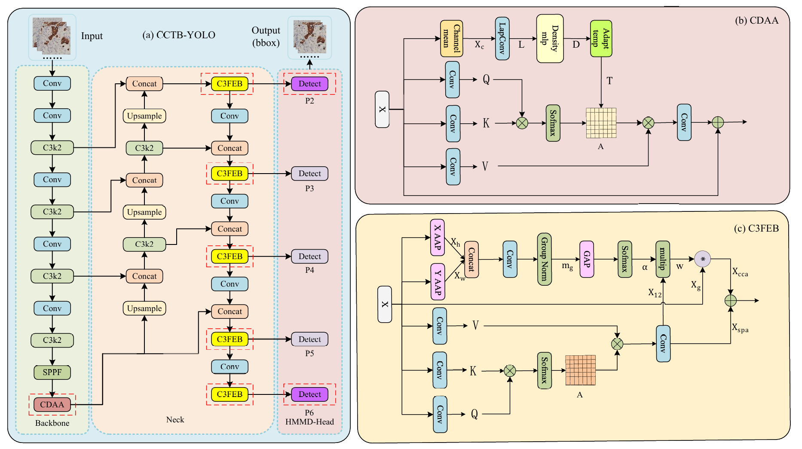
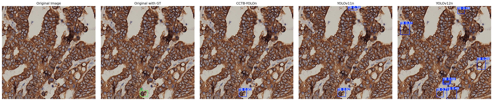
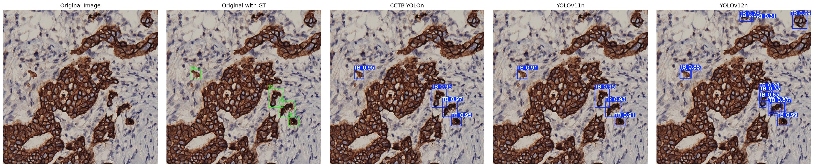

# CCTB-YOLO: A Framework Based on Cross-Channel and Cellular Density Attention for Tumor Budding Detection in Colorectal Cancer

[](LICENSE)
[](#)
[](#)

CCTB-YOLO is an advanced deep learning framework specifically designed for tumor budding detection in colorectal cancer histopathological images. Based on the YOLOv11 architecture, this framework incorporates Cross-channel attention mechanisms (C3FEB) and Cellular Density Attention mechanisms (CDAA) along with a Hierarchical Multi-Magnification Detection Head (HMMD-Head), significantly improving the accuracy and robustness of tumor budding detection.

## 🏗️ Network Architecture



### Core Innovations

- **Cross-Channel Attention (C3FEB) Module**: Enhances multi-scale feature fusion capability and improves the model's sensitivity to small targets
- **Cellular Density Attention (CDAA) Module**: Specifically designed for tumor budding spatial distribution characteristics, effectively capturing cell-dense regions
- **Improved Backbone Network**: Optimized architecture based on YOLOv11 with stronger feature extraction capabilities
- **Hierarchical Multi-Magnification Detection Head (HMMD-Head)**: Adapts to tumor budding detection at different magnification levels

## 🚀 Quick Start

### Installation

1. **Clone the Repository**

```bash
git clone https://github.com/TPA2001/CCTB-YOLO.git
cd CCTB-YOLO
```

2. **Create Virtual Environment (Recommended)**

```bash
python -m venv venv
source venv/bin/activate  # Linux/Mac
# or
venv\Scripts\activate     # Windows
```

3. **Install Dependencies**

```bash
pip install -r requirements.txt
```

4. **Prepare Dataset**

```bash
# Download the dataset and place it in the project directory according to the structure below
# The dataset should include images and annotation files for training, validation, and testing sets
```

### Dataset Structure

```
data/
├── train/
│   ├── images/
│   └── labels/
├── val/
│   ├── images/
│   └── labels/
└── test/
    ├── images/
    └── labels/
```

### Model Training

```bash
# Train the model with default configuration
python train.py

# Custom training parameters
python train.py --epochs 300 --batch-size 32 --img-size 1280
```

### Model Evaluation

```bash
# Evaluate the trained model
python evaluate.py --weights runs/train/exp/weights/best.pt
```

### Inference Prediction

```bash
# Predict on a single image
python detect.py --source data/test_images/image.jpg --weights runs/train/exp/weights/best.pt

# Predict on an entire folder
python detect.py --source data/test_images/ --weights runs/train/exp/weights/best.pt
```

## 📊 Dataset

### Dataset Download

Please refer to [TB-YOLO Dataset](https://github.com/weiwei0410zhou/TB-YOLO)

### Data Format

This project uses the YOLO format dataset:

- Image format: JPG/PNG
- Annotation format: TXT (each image corresponds to one annotation file)
- Annotation content: Each line represents one object in the format `class_id center_x center_y width height` (relative coordinates)

## 🖼️ Visualization

### Test Set Results Comparison



### Multi-Scale Detection Effect



## 🤝 Contributing

We welcome contributions of any kind! If you'd like to contribute to the project, please follow these steps:

1. Fork this repository
2. Create your feature branch (`git checkout -b feature/AmazingFeature`)
3. Commit your changes (`git commit -m 'Add some AmazingFeature'`)
4. Push to the branch (`git push origin feature/AmazingFeature`)
5. Open a Pull Request

## 📄 License

This project is licensed under the GPL-3.0 License. See the [LICENSE](LICENSE) file for details.

## 📞 Contact

If you have any questions or suggestions, please contact us through the following channels:

- Email: [your-email@example.com]
- GitHub Issues: [Issues](https://github.com/TPA2001/CCTB-YOLO/issues)

## 🙏 Acknowledgements

Thanks to all individuals and organizations that have provided help and support for this project.
